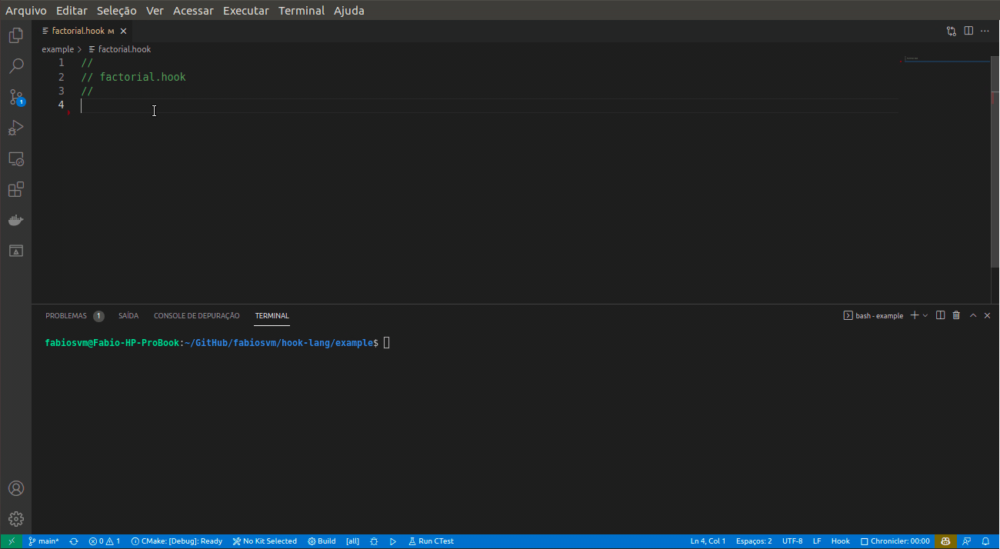

# Hook Visual Studio Code Extension

Visual Studio Code support for Hook Programming Language.

## What is Hook?

Hook is a simple, small, cross-platform, dynamically typed scripting language that combines imperative and functional programming.

See more about Hook on [GitHub](https://github.com/fabiosvm/hook-lang).

## Features

This extension provides the following features:

* Syntax Highlighting
* Snippets

  
   
  <em>(Syntax Highlighting and Snippets)</em>

## License

This project is released under [MIT](https://choosealicense.com/licenses/mit/) license.
See [LICENSE](https://github.com/fabiosvm/hook/blob/main/LICENSE) for more details.
